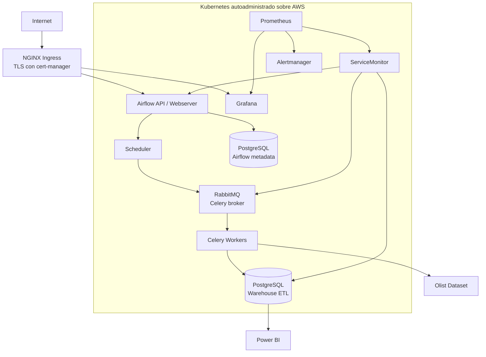

# POLARIS Platform

## Plataforma ETL segura sobre Kubernetes autoadministrado


POLARIS Platform es el repositorio de plataforma del proyecto de portafolio **POLARIS Logistics**. Define y despliega la capa Kubernetes que ejecuta una plataforma ETL orientada a datos de comercio electrónico: Airflow coordina los procesos, Celery distribuye la ejecución, RabbitMQ actúa como broker y PostgreSQL almacena los datos operacionales y analíticos.

El objetivo no es únicamente ejecutar workloads, sino demostrar cómo una plataforma de datos puede entregarse con prácticas de **DevSecOps**: configuración declarativa, validaciones automatizadas, escaneo de infraestructura como código, gestión externa de secretos, observabilidad, TLS y despliegues reproducibles.

> **Estado del proyecto:** repositorio funcional de portafolio. La infraestructura AWS y el código ETL viven en repositorios relacionados; este repositorio concentra la plataforma Kubernetes, sus valores Helm, sus manifiestos de entrada y el pipeline de entrega.

## Índice

- [Contexto y objetivo](#contexto-y-objetivo)
- [Arquitectura](#arquitectura)
- [Componentes](#componentes)
- [Decisiones técnicas](#decisiones-técnicas)
- [Seguridad y DevSecOps](#seguridad-y-devsecops)
- [Estructura del repositorio](#estructura-del-repositorio)
- [Requisitos](#requisitos)
- [Despliegue](#despliegue)
- [Validación local](#validación-local)
- [CI/CD](#cicd)
- [Operación y troubleshooting](#operación-y-troubleshooting)
- [Repositorios relacionados](#repositorios-relacionados)
- [Próximos pasos](#próximos-pasos)

## Contexto y objetivo

POLARIS Logistics modela un escenario empresarial en el que los pedidos deben procesarse diariamente para generar indicadores antes del inicio de la jornada. El flujo de datos utiliza el **Olist Brazilian E-Commerce Dataset**, que contiene clientes, pedidos, productos, vendedores, pagos y reseñas.

La plataforma se separa en capas para mantener responsabilidades claras:

| Capa | Responsabilidad | Repositorio |
| --- | --- | --- |
| Infraestructura | VPC, subnets, EC2, IAM, EBS y acceso al clúster | `polaris-infrastructure` |
| Plataforma | Kubernetes, Helm, networking, servicios, seguridad y observabilidad | **Este repositorio** |
| Datos | DAGs y código de extracción, transformación y carga | `polaris-airflow` / repositorio ETL |

Esta separación permite revisar cambios de infraestructura, plataforma y código de datos de forma independiente, con pipelines y controles apropiados para cada dominio.

## Arquitectura



La topología base es un clúster K3s/Kubernetes autoadministrado sobre instancias EC2 privadas, preparado por el repositorio de infraestructura. El tráfico público entra por el proxy/bastión y se entrega al `ingress-nginx`; los workloads de datos permanecen en namespaces internos.

## Componentes

| Componente | Implementación | Propósito |
| --- | --- | --- |
| Orquestación ETL | Apache Airflow, `CeleryExecutor` | Programar y coordinar DAGs |
| Ejecución distribuida | Celery Workers | Ejecutar tareas ETL en paralelo |
| Mensajería | RabbitMQ | Broker para Celery |
| Persistencia | PostgreSQL | Metadatos de Airflow y warehouse |
| Networking | Cilium | CNI basado en eBPF y políticas de red |
| Entrada | ingress-nginx | Exponer servicios HTTP/HTTPS |
| Certificados | cert-manager + Let's Encrypt | Emitir y renovar certificados TLS |
| Observabilidad | kube-prometheus-stack | Prometheus, Grafana, Alertmanager y exporters |
| Empaquetado | Helm | Configurar y versionar releases |
| Seguridad | Checkov, Trivy, SonarCloud | Revisar manifests, IaC y calidad estática |
| Entrega | GitHub Actions | Validar, escanear y desplegar |

## Decisiones técnicas

### Kubernetes autoadministrado

Se utiliza Kubernetes sobre AWS sin EKS para demostrar el dominio de la operación de un clúster: bootstrap del control plane y workers, CNI, acceso al API server, ingress, almacenamiento y despliegue de componentes. La infraestructura base se aprovisiona de manera independiente con Terraform y Ansible.

### Helm y valores separados del chart

Los charts upstream se consumen desde sus repositorios oficiales y las personalizaciones del proyecto viven en `charts/*/values.yaml`. Esto conserva la mantenibilidad del software de terceros y permite revisar las decisiones específicas de POLARIS sin copiar charts completos.

El pipeline también descarga los charts, ejecuta `helm lint` y genera manifests en `rendered/`. Escanear el resultado renderizado es importante: es la configuración que realmente recibirá el clúster, no solo el archivo de valores.

### Namespaces por dominio

Los workloads se organizan en `airflow`, `data` y `monitoring`. Esta separación facilita permisos, troubleshooting, políticas de red y lectura operativa del clúster.

### Almacenamiento persistente

PostgreSQL, RabbitMQ, Prometheus y Grafana solicitan almacenamiento persistente mediante la clase `ebs-sc`, provista por AWS EBS CSI. RabbitMQ y la observabilidad declaran tamaños y límites de recursos explícitos para hacer visible el comportamiento esperado del ambiente.

## Seguridad y DevSecOps

La seguridad se trata como una condición del ciclo de entrega, no como una revisión posterior:

- **YAMLLint:** sintaxis y estilo de `charts`, `ingress` y `namespaces`.
- **Helm lint:** validación de los charts upstream con los valores del proyecto.
- **Render reproducible:** generación de manifests para inspección y escaneo.
- **Checkov:** controles de seguridad sobre recursos Kubernetes renderizados.
- **Trivy:** detección de configuraciones críticas y altas en los manifests.
- **SonarCloud:** análisis estático y consulta del Quality Gate.
- **Secretos fuera de Git:** contraseñas, claves Fernet, claves API y conexiones se consumen desde Kubernetes Secrets existentes.
- **Hardening de pods:** ejecución como usuario no root donde es compatible, `seccompProfile: RuntimeDefault`, eliminación de capabilities y restricción de privilege escalation.
- **TLS automático:** cert-manager gestiona certificados de Let's Encrypt mediante desafíos HTTP-01.
- **OIDC en la capa de infraestructura:** el repositorio de infraestructura usa federación de identidad para GitHub Actions y evita credenciales AWS de larga duración.

Las excepciones de Trivy están documentadas en [docs/trivy-ignore.yaml](docs/trivy-ignore.yaml) y se limitan a comportamientos requeridos por charts upstream, como componentes de cert-manager e ingress-nginx. Una excepción no se considera una aprobación silenciosa: debe conservar su justificación y revisarse cuando se actualice el chart.

> **Nota de operación:** `charts/airflow/values.yaml` referencia Secrets que deben existir antes de desplegar. Nunca deben sustituirse por contraseñas en texto plano ni confirmarse en el repositorio.

## Estructura del repositorio

```text
.
├── charts/                         # Valores Helm específicos de POLARIS
│   ├── airflow/                    # Airflow + CeleryExecutor + git-sync
│   ├── aws-ebs-csi-driver/         # Configuración del almacenamiento EBS
│   ├── cert-manager/               # cert-manager y ClusterIssuer
│   ├── ingress-nginx/              # Entrada HTTP/HTTPS
│   ├── monitoring/                 # Prometheus, Grafana y Alertmanager
│   ├── postgresql/                 # Base de datos y warehouse
│   └── rabbitmq/                   # Broker y métricas
├── ingress/                        # Reglas Ingress adicionales, como Grafana
├── namespaces/                     # Namespaces de la plataforma
├── docs/                           # Excepciones y documentación de seguridad
├── pulled/                         # Charts descargados para lint/render local o CI
├── rendered/                       # Manifests generados para revisión y escaneo
├── .github/workflows/deploy.yml   # Pipeline de CI/CD
├── .yamllint.yml                   # Reglas de validación YAML
├── inflaestrutura.md               # Contexto del repositorio de infraestructura
└── POLARIS-Proyecto-Self-Managed-Kubernetes.md
																		# Contexto general del proyecto
```

## Requisitos

### Para validar configuración

- Helm `3.15.4` o compatible.
- `kubectl` configurado contra un clúster de prueba.
- `yamllint`.
- Trivy.
- Checkov.
- Acceso a los repositorios Helm configurados en el workflow.

### Para desplegar

- Un clúster Kubernetes operativo con acceso al API server.
- Helm y `kubectl` autenticados en el contexto correcto.
- CNI Cilium y la clase de almacenamiento `ebs-sc` instalados por la capa de infraestructura.
- DNS apuntando a la entrada pública para `polaris-airflow.duckdns.org` y `polaris-grafana.duckdns.org`, o hosts equivalentes configurados en los manifests.
- Kubernetes Secrets requeridos por Airflow, PostgreSQL, RabbitMQ y Grafana.
- Permisos para crear namespaces, CRDs, releases Helm, Ingresses, PVCs y recursos de observabilidad.

## Despliegue

El despliegue automatizado usa `helm upgrade --install` para que las operaciones sean repetibles. La secuencia principal es:

1. Crear o verificar los namespaces.
2. Instalar cert-manager y aplicar `ClusterIssuer`.
3. Instalar ingress-nginx.
4. Instalar kube-prometheus-stack.
5. Instalar PostgreSQL y RabbitMQ en `data`.
6. Instalar o actualizar Airflow en `airflow`.
7. Aplicar el Ingress de Grafana.
8. Esperar la migración de Airflow y verificar los rollouts.

Para un despliegue manual, la forma recomendada es reproducir los comandos del job `deploy` en [.github/workflows/deploy.yml](.github/workflows/deploy.yml), después de preparar los Secrets y el contexto `kubectl`. El pipeline mantiene versiones explícitas para Airflow, PostgreSQL y RabbitMQ; los charts restantes deben fijarse también antes de utilizar el proyecto en un ambiente productivo.

### Secretos mínimos

Los nombres esperados se encuentran en los valores Helm. Entre ellos están:

- `airflow-metadata`, `airflow-result-backend` y `airflow-broker-url`.
- `airflow-fernet-key`, `airflow-api-secret-key` y `airflow-jwt-secret`.
- `postgres-creds`, `warehouse-creds` y `rabbitmq-creds`.
- `grafana-admin-creds`.
- `polaris-etl-secrets`.

La creación de estos secretos debe realizarse con un mecanismo seguro de la plataforma, por ejemplo un gestor externo de secretos o un procedimiento controlado en el nodo. No se incluyen valores de ejemplo con credenciales reales en este repositorio.

## Validación local

Validación rápida de YAML y manifiestos:

```bash
yamllint charts ingress namespaces

helm repo add bitnami https://charts.bitnami.com/bitnami
helm repo add apache-airflow https://airflow.apache.org
helm repo add prometheus-community https://prometheus-community.github.io/helm-charts
helm repo add jetstack https://charts.jetstack.io
helm repo add ingress-nginx https://kubernetes.github.io/ingress-nginx
helm repo update
```

Para reproducir exactamente la validación de charts, ejecute el job `helm-lint` del workflow. Para una revisión de seguridad, use los manifests renderizados:

```bash
trivy config \
	--severity CRITICAL,HIGH \
	--ignorefile docs/trivy-ignore.yaml \
	rendered/

checkov -d rendered --framework kubernetes
```

## CI/CD

El workflow [.github/workflows/deploy.yml](.github/workflows/deploy.yml) sigue esta secuencia:

```text
YAMLLint
	 -> Helm lint + render + Checkov
	 -> Trivy + SonarCloud
	 -> Deploy en runner self-hosted
	 -> Verificación de rollouts y certificados
```

Los cambios en `main` activan el flujo cuando afectan charts, ingress, namespaces o el propio workflow. Los Pull Requests ejecutan las validaciones, mientras que el despliegue requiere push a `main` o un `repository_dispatch` de tipo `deploy-airflow`. El job final corre en un runner self-hosted con conectividad al API server del clúster y está protegido por el environment `production`.

Los reportes de Checkov, SonarCloud y el resultado del análisis se conservan como artefactos o se envían a la dirección configurada en los secretos del repositorio. La entrega se detiene si Trivy encuentra configuraciones `CRITICAL` o `HIGH`; Checkov mantiene `soft_fail: true` para permitir revisar sus hallazgos como evidencia del pipeline.

## Operación y troubleshooting

Comandos útiles después de un despliegue:

```bash
kubectl get nodes
kubectl get pods -A
kubectl get pvc -A
kubectl get ingress -A
kubectl get certificate -A

kubectl get pods -n airflow
kubectl get pods -n data
kubectl get pods -n monitoring
```

Para aislar problemas:

```bash
helm list -A
kubectl describe pod <pod> -n <namespace>
kubectl logs <pod> -n <namespace> --all-containers
kubectl get events -n <namespace> --sort-by=.lastTimestamp
```

Airflow se despliega sin `--wait` de forma intencional: su job de migración se ejecuta como hook y los pods esperan a que termine. El workflow verifica después la migración y el estado de cada componente para evitar el bloqueo circular que produciría esperar la disponibilidad antes de ejecutar el hook.

## Repositorios relacionados

- **Infraestructura:** `polaris-infrastructure`, descrito en [inflaestrutura.md](inflaestrutura.md). Provisiona AWS con Terraform, configura hosts con Ansible y prepara el clúster.
- **Contexto del proyecto:** [POLARIS-Proyecto-Self-Managed-Kubernetes.md](POLARIS-Proyecto-Self-Managed-Kubernetes.md). Documenta el problema de negocio, el dataset, el modelo de datos y la visión completa de los tres repositorios.
- **Código ETL:** repositorio de Airflow referenciado por `dags.gitSync.repo` en [charts/airflow/values.yaml](charts/airflow/values.yaml). Contiene DAGs y lógica de extracción, transformación y carga.

## Próximos pasos

- Fijar versiones de todos los charts upstream para eliminar drift de dependencias.
- Integrar un gestor externo de secretos y rotación automatizada.
- Añadir NetworkPolicies de Cilium explícitas entre namespaces y workloads.
- Incorporar pruebas de restauración para PostgreSQL, RabbitMQ y Prometheus.
- Publicar dashboards y alertas de SLO para Airflow, colas y duración de DAGs.
- Añadir validación de políticas con Kyverno o Gatekeeper.
- Separar ambientes `dev`, `staging` y `production` con valores y approvals propios.

## Licencia

Proyecto de portafolio personal. Los charts y componentes de terceros mantienen sus respectivas licencias.